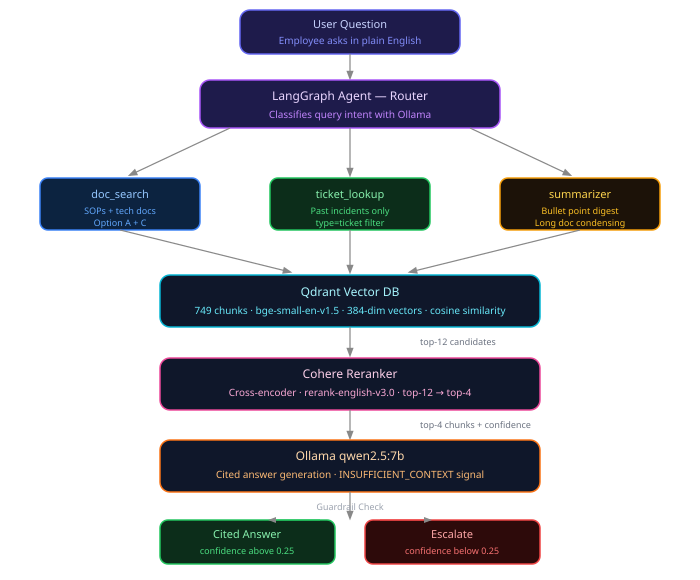

# Enterprise Knowledge Copilot

> An agentic RAG system that answers IT employee questions with cited answers from internal SOPs, runbooks, and past support tickets — powered entirely by local open-source models.

[](https://python.org)
[](https://langchain-ai.github.io/langgraph/)
[](https://qdrant.tech)
[](https://ollama.com)

---

## The Problem

Large IT companies lose thousands of engineer-hours every year to three recurring problems:

- **Duplicate support tickets** — the same issue gets reported and resolved repeatedly by different engineers who never knew it was already solved
- **Scattered documentation** — SOPs, runbooks, and procedures live across PDFs, wikis, and Confluence pages with no unified search
- **Slow onboarding** — new engineers spend days finding answers that exist somewhere in the knowledge base

---

## The Solution

An Enterprise Knowledge Copilot that gives every engineer instant, cited answers from the company's internal knowledge base.

| Feature | How it works |
|---|---|
| Cited answers | Every claim links to the exact source document and page |
| Duplicate ticket detection | Surfaces past resolved tickets matching the current problem |
| Document summarization | Condenses long runbooks into 3-5 bullet points |
| Honest escalation | Refuses to answer when not confident — never hallucinates |
| PII protection | Presidio redacts all personal data before indexing |

---

## Architecture



The system is built as a **LangGraph StateGraph** — a stateful agentic pipeline where every node reads from and writes to a shared `AgentState`. The router dynamically selects which tool to use per query, and a confidence-based guardrail conditionally routes to escalation instead of returning a low-quality answer.

**Query flow:**

1. Employee types a question in the Chainlit UI
2. Router node classifies intent → selects `doc_search`, `ticket_lookup`, or `summarizer`
3. Selected node queries Qdrant vector DB → retrieves top-12 chunks
4. Cohere cross-encoder reranks top-12 → top-4 most relevant chunks
5. Ollama generates a cited answer using only the retrieved context
6. Guardrail checks confidence score and `INSUFFICIENT_CONTEXT` signal
7. If confident → return cited answer. If not → escalate to human support queue

---

## Tech Stack

| Layer | Tool | Why |
|---|---|---|
| LLM | Ollama qwen2.5:7b | Free, local, no API cost |
| Embeddings | bge-small-en-v1.5 | Competitive quality, CPU-friendly, free |
| Vector DB | Qdrant Cloud | Production-credible, metadata filtering, free tier |
| Reranker | Cohere Rerank API | Cross-encoder accuracy, free trial |
| RAG Chain | LangChain LCEL | Composable pipe syntax, LangSmith auto-tracing |
| Agent | LangGraph StateGraph | Stateful nodes, conditional edges |
| Observability | LangSmith | Auto-traces every LangChain and LangGraph call |
| PII Redaction | Microsoft Presidio | Redacts spans only, preserves document structure |
| API | FastAPI | REST interface, Swagger auto-generated |
| UI | Chainlit | Built for LLM chat, streaming, source citations |

---

## Dataset

We use **Option A + Option C** from the problem statement:

**Option A — Public IT documentation (11 files)**
Real technical docs from Kafka, Kubernetes, Docker, FastAPI, and Python. Provides technical depth and demonstrates the system works on real documentation formats.

**Option C — Synthetic Northwind Systems corpus**
- 20 internal SOPs generated by Ollama (VPN setup, incident response, onboarding, etc.)
- 200 IT support tickets with 4 deliberately planted duplicate Kafka consumer lag tickets
- One planted knowledge gap: Singapore deployment policy — triggers escalation in the demo

> Northwind Systems is fictional. Because the LLM has never seen Northwind documents, every correct answer is provably coming from retrieval — not from model training memory.

**Total: 749 chunks indexed in Qdrant**

---

## Evaluation Results

### Retrieval quality (eval/eval_retrieval.py)

| Metric | Without Rerank | With Rerank | Change |
|---|---|---|---|
| Precision@4 | 0.587 | 0.630 | +0.043 |
| Recall@4 | 0.761 | 0.761 | +0.000 |
| F1 | 0.649 | 0.676 | +0.027 |
| MRR | 0.786 | 0.783 | -0.004 |

Cohere reranking improves precision by 4.3% — meaning more of the 4 chunks fed to the LLM are actually relevant to the query.

### Answer quality (eval/eval_ragas.py — LLM-as-Judge via Ollama)

| Metric | Score |
|---|---|
| Avg Faithfulness | 4.5 / 5.0 |
| Avg Answer Relevancy | 3.8 / 5.0 |
| Escalation Accuracy | 3 / 3 (100%) |

Faithfulness of 4.5/5 means 90% of claims in answers are grounded in retrieved context. Escalation accuracy of 100% means every knowledge gap question triggered escalation instead of hallucination.

---

## Setup

### Prerequisites

- Python 3.11 (recommended) or 3.10+
- [Ollama](https://ollama.com) installed
- [Qdrant Cloud](https://cloud.qdrant.io) free account
- [Cohere](https://cohere.com) free trial API key
- [LangSmith](https://smith.langchain.com) free account

### Installation

```bash
git clone https://github.com/JasonPinto24/CoPilot.git
cd CoPilot

python -m venv venv
venv\Scripts\activate        # Windows
source venv/bin/activate     # Mac / Linux

pip install -r requirements.txt
python -m spacy download en_core_web_lg

ollama pull qwen2.5:7b
```

### Configuration

Create a `.env` file in the project root:

```env
OLLAMA_BASE_URL=http://localhost:11434
OLLAMA_MODEL=qwen2.5:7b

QDRANT_URL=your-qdrant-cluster-url
QDRANT_API_KEY=your-qdrant-api-key

COHERE_API_KEY=your-cohere-api-key

LANGCHAIN_TRACING_V2=true
LANGCHAIN_API_KEY=your-langsmith-api-key
LANGCHAIN_PROJECT=CoPilot
LANGCHAIN_ENDPOINT=https://api.smith.langchain.com
```

---

## Running the Project

### Step 1 — Build the knowledge base (one-time setup)

```bash
python -m scripts.gen_corpus          # generate Northwind SOPs and tickets
python -m scripts.download_option_a   # download public IT docs
python -m scripts.index               # embed and index all 749 chunks into Qdrant
```

### Step 2 — Start the demo

```bash
chainlit run app/ui.py
```

Open `http://localhost:8000` in your browser.

### Step 3 — Run evaluation

```bash
python -m eval.eval_retrieval   # P@4, Recall, F1, MRR with/without reranking
python -m eval.eval_ragas       # Faithfulness, Answer Relevancy, Escalation Accuracy
```

---

## Demo Script

These 5 questions demonstrate every feature of the system:

| # | Question | Feature shown |
|---|---|---|
| 1 | How do I set up VPN at Northwind? | Basic RAG with inline citations from SOP |
| 2 | Summarize the Kubernetes deployment docs | Summarizer node — bullet point digest |
| 3 | I am getting consumer-group lag on the payment service. Has anyone seen this before? | Ticket lookup — surfaces 4 duplicate resolved tickets |
| 4 | What is Northwind's deployment policy for the Singapore region? | Escalation — planted knowledge gap |
| 5 | Compare our Kafka troubleshooting guide with related incident tickets | Multi-source retrieval across doc and ticket corpora |

Question 3 is the strongest demo moment — the system instantly surfaces 4 past tickets all with the same resolution, proving the duplicate ticket detection works end to end.

---

## Project Structure

```
CoPilot/
├── src/
│   ├── config.py           # single source of truth for all settings
│   ├── pii.py              # Presidio PII redaction
│   ├── ingest.py           # document loaders (PDF, Markdown, CSV)
│   ├── chunk.py            # RecursiveCharacterTextSplitter
│   ├── embed_store.py      # bge-small embeddings + Qdrant upsert
│   ├── retrieve.py         # Qdrant top-k vector search
│   ├── rerank.py           # Cohere cross-encoder reranking
│   ├── chains.py           # LCEL chain — the contract Carolin imports
│   ├── state.py            # AgentState TypedDict
│   └── nodes/
│       ├── router.py       # query intent classifier
│       ├── doc_search.py   # searches SOPs and technical docs
│       ├── ticket_lookup.py # searches only support tickets
│       ├── summarizer.py   # condenses content to bullet points
│       ├── generate.py     # citation-aware answer generation
│       ├── guardrail.py    # confidence check + escalation trigger
│       └── escalate.py     # structured escalation response
├── scripts/
│   ├── gen_corpus.py       # generate Northwind SOPs and tickets with Ollama
│   ├── download_option_a.py # download public IT documentation
│   └── index.py            # run full ingestion pipeline
├── eval/
│   ├── qa_set.json         # 26 gold Q&A pairs for evaluation
│   ├── eval_retrieval.py   # P@4, Recall, F1, MRR metrics
│   └── eval_ragas.py       # LLM-as-Judge answer quality evaluation
├── app/
│   ├── api.py              # FastAPI POST /ask endpoint
│   └── ui.py               # Chainlit chat UI
├── data/
│   ├── raw/
│   │   ├── option_a/       # public IT docs (Kafka, K8s, Docker, FastAPI, Python)
│   │   └── option_c/       # synthetic Northwind SOP markdown files
│   └── tickets.csv         # 200 synthetic IT support tickets
├── docs/
│   └── architecture.svg    # system architecture diagram
├── .env                    # API keys — never committed
├── requirements.txt
└── README.md
```

---

## Team

**Jason** — Data pipeline, retrieval system, embeddings, evaluation
`src/config.py` · `src/pii.py` · `src/ingest.py` · `src/chunk.py` · `src/embed_store.py` · `src/retrieve.py` · `src/rerank.py` · `src/chains.py` · `scripts/` · `eval/`

**Carolin** — LangGraph agent, API, UI
`src/state.py` · `src/nodes/` · `src/graph.py` · `app/api.py` · `app/ui.py`

---

## License

MIT License